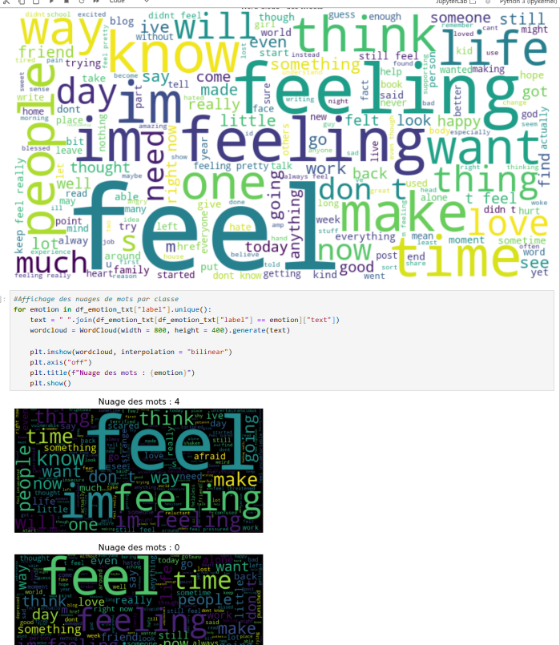
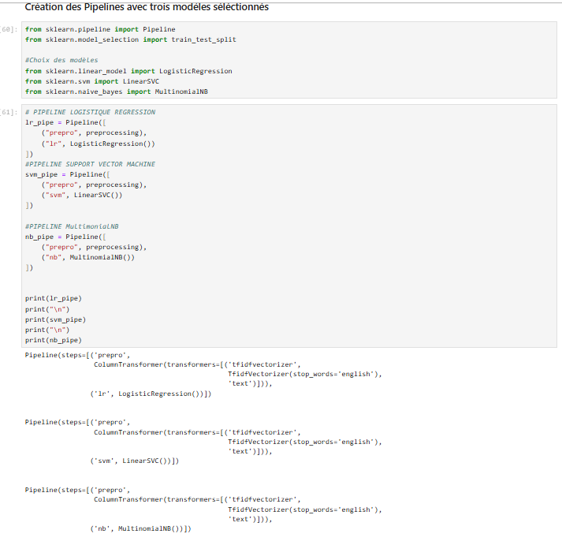
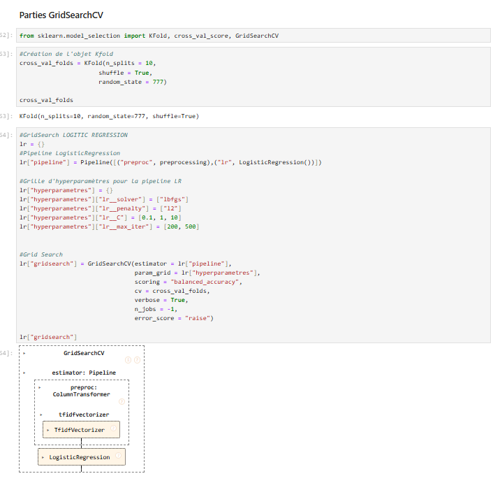
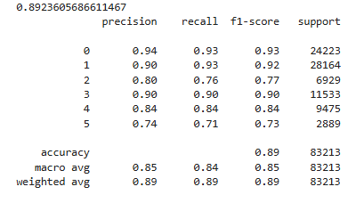
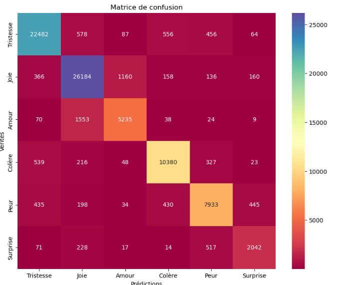
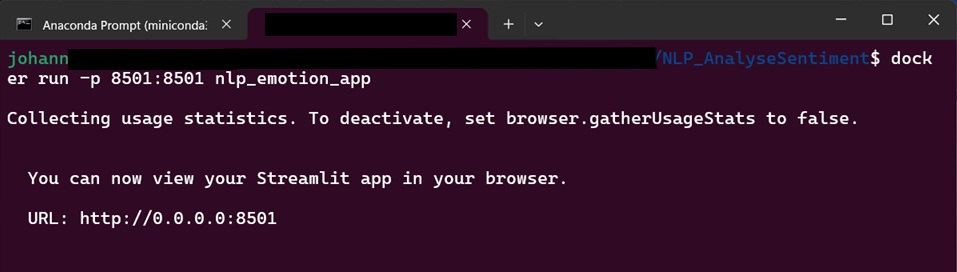
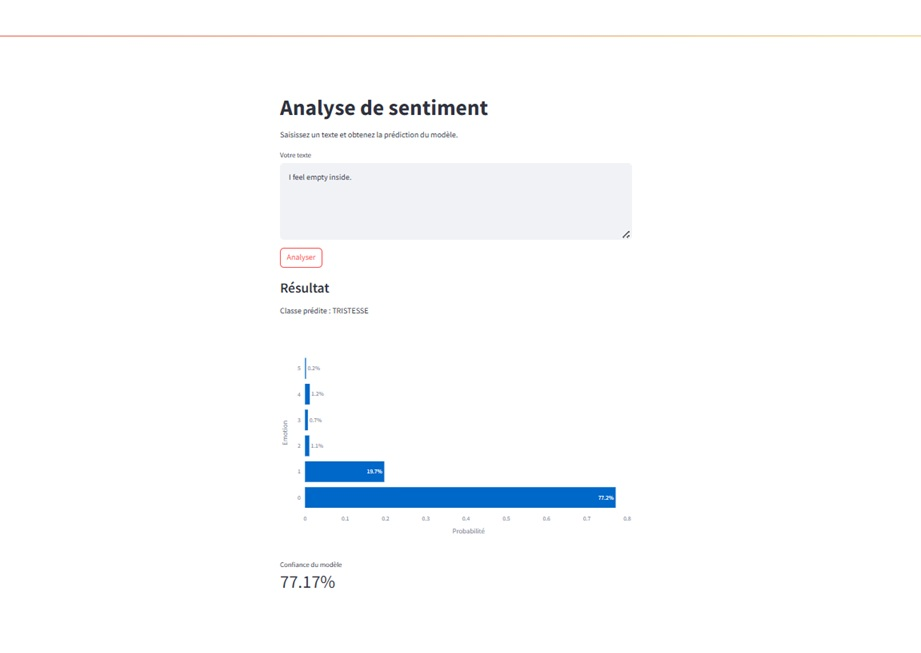

<h1>Projet : NLP Analyse émotionnelle</h1>

<h3>Détection des émotion humaines à partir de courtes phrases.</h3>

<h2>Introduction:</h2>

Dans ce projet personnel qui a pour objectif d'améliorer mes compétences dans le domaine du machine learning, j'ai entraîné un modèle  de régression logistique afin d'identifier l'émotion dominante dans une phrase courte.  L'application streamlit sera nécessaire pour tester le modèle sur différents échantillons de phrase correspondant à six classes d'émotions Pour ce faire , on transforme le texte brut en une émotion interprétable.
 

Les émotions sujet à détection:

<ul>
           <li>Joie</li>
           <li>Tristesse</li>
           <li>Amour</li>
           <li>Peur</li>
           <li>Surprise</li>
           <li>Colère</li>
</ul>

C'est un modèle qui pourrait potentiellement intégrer une application telle qu'un outil d'analyse ou bien un système interactif.

<h2>Etape de la création du modèle</h2>

J'ai choisi la création d'une simple pipeline qui à pour charge de:

<ul>
           <li>Nettoyer le texte</li>
           <li>Utilisation de la Vectorisation TF-IDF sur la colonne "text" pour le praitraitement</li>
           <li>Utilisation d'une GridSearch parmi 3 Pipelines contenant chacun un modèle séléctionnés pour notre cas d'usage.( LogisticRegression, LinearSVC, MultinomialNB). </li>
           <li>Entrainement final avec la pipeline qui à obtenu le meilleurs score. A savoir la régréssion de logisitque.</li>
           <li>Création d'un Streamlit permettant de tester le modèle en effectuant un prompt. Elle affichera la classe correspondant au texte une statistique de mesure sur les différentes classes</li>
           <li>Une déploiement Docker à était effectuer afin de permettre de tester plus facilement l'application</li>
           
           
           
</ul>

<h2>Mesure de Performance</h2>
<ul>

Oberservation: Selon les résultats en dessous le modèle est très performant et généralise bien sur la l'ensemble des classes. Cependant, des faiblesses sur certaines émotions sont à noter, comme celui de la peur qui doit être confondu avec l'émotion surprise, qui d'ailleurs est l'émotion  la plus difficile à reconnaitre.

           
           <li><b>Acuracy:  89%</b> </li>
           <li><b>Macro F1-score :  85%</b></li>
           <li><b>Weighted F1-score 89%</b></li>
</ul>

<h2>Matrice de confusion:</h2>
<ul>
           
           
On peut observer:

           <li>Les émotions fortes (tristesse, joie, colère) sont très bien capturées</li>
           <li>Les confusions se produisent surtout entre émotions proches (peur, surprise)</li>
           <li>Le modèle reste cohérent et stable</li>
</ul>

<h2>Exemple d'utilisation:</h2>
Dans le prompt, écrire une courte phrase en anglais. Puis appuyer sur le bouton analyser afin d'afficher la classe de l'émotion correspondant à la phrase. 

<h2>Déploiement dans le Docker</h2>
<nav>
           <li><b>Activer le Docke</b>r</li>
           <ul>ligne de commande à entrer dans l'invite de commande Ubuntu:
                      <li><b>docker build -t nlp_emotion_app .</b>  (</i>Pour construire l'image dans le Docker</i>)</li>
                      <li><b>docker images</b>  (<i>Vérifier si l'image a bien été construite<i>)</li>
                      <li><b>docker run -p 8501:8501 nlp_emotion_app</b>     (<i>Lancer l'interface<i>)</li>
           </ul>
           
           <h4>Par la suite, pour ouvrir l'interface streamlit:</h4>
           <ul>
Dans une nouvelle fenêtre, entrez dans la barre URL :

                      <li><b>http://localhost:8501</b></li> 
            
           </ul>
</nav>

<h2>Structure du projet</h2>
<pre style="font-family: Consolas, monospace; font-size: 15px; line-height: 1.4;">
NLP_AnalyseDeSentiment/
│
├── data/
├── model/
│   └── model_lr.pkl
├── notebooks/
│   ├── 1_EDA.ipynb
│   └── 2_Prepro_ML.ipynb
├── capture_img/
├── app.py
├── Dockerfile
├── requirements.txt
└── README.md
</pre>

<h2>Technologies utilisées</h2>
<ul>
<li>Python</li>
<li>Numpy / Pandas</li>
<li>Scikil-learn</li>
<li>NLP</li>
<li>Streamlit</li>
<li>Docker</li>        
</ul>

<h2>Conclusion</h2>

Ce projet personnel assez basique m'a permis de monter en compétence dans le domaine du NLP, surtout sur la manière de nettoyer et de prétraiter les données. Ça était pour moi une bonne expérience enrichissante. Cela m'a permis de concevoir une application interactive basée sur un modèle léger et efficace, adaptée à l’analyse d’émotions dans des textes courts. Les évolutions possibles incluent l’ajout de la prise en charge du français, soit via un dataset d’émotions francophone, soit par la création d’un jeu de données dédié, ou encore par la traduction automatique des phrases avant leur traitement par le modèle.

Auteur du projet: <b>Johann JOURNAUX</b>

